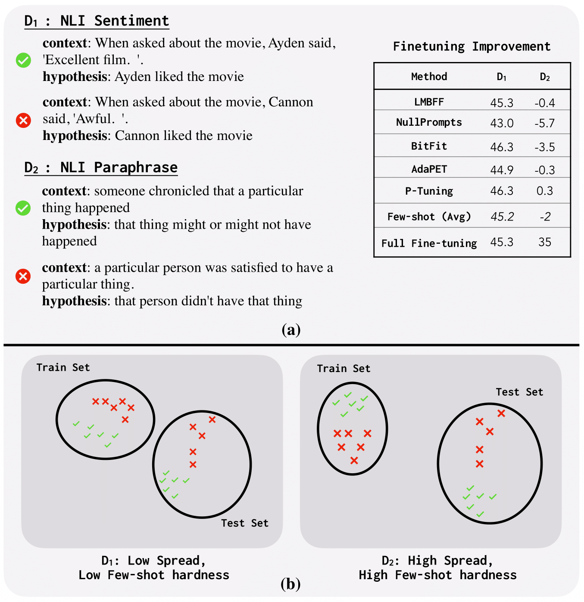

# On Measuring the Intrinsic Few-Shot Hardness of Datasets

  

This repository contains code, scripts, and data for running experiments in the following paper:
> Xinran Zhao*, Shikhar Murty*, Christopher Manning
>
> [On Measuring the Intrinsic Few-Shot Hardness of Datasets]

The experiments use datasets that can be downloaded here:
- GLUE ([Wang et al., 2018](https://arxiv.org/abs/1804.07461)): [download](https://gluebenchmark.com/)
- SuperGLUE: ([Wang et al., 2019](https://arxiv.org/abs/1905.00537)): [download](https://super.gluebenchmark.com/)
- FS-NLI: [download](https://drive.google.com/file/d/1jtjr17dfhWupabRslSa2nlShMRPi40aJ/view?usp=share_link)

## Abstract

While advances in pre-training have led to dramatic improvements in few-shot learning of NLP tasks, there is limited understanding of what drives successful few-shot adaptation in datasets. In particular, given a new dataset and a pre-trained model, what properties of the dataset make it few-shot learnable and are these properties independent of the specific adaptation techniques used? We consider an extensive set of recent few-shot learning methods, and show that their performance across a large number of datasets is highly correlated,  showing that few-shot hardness may be intrinsic to datasets, for a given pre-trained model. To estimate intrinsic few-shot hardness, we then propose a simple and lightweight metric called Spread that captures the intuition that few-shot learning is made possible by exploiting feature-space invariances between training and test samples. Our metric better accounts for few-shot hardness compared to existing notions of hardness, and is ~8--100x faster to compute.

## Dependency

Python 3.7, pandas, sklearn, scipy, matplotlib, seaborn

## Introduction

This repo contains the code to reproduce the results in paper from our results on various few-shot adaptation methods and hardness metrics.

## Data Format

**heatmap_raw_data.json**: Bundled datasets of model performance and raw metric scores. The key, values are:

| Key | Value | 
| :---: | :---: | 
| output_collection | the output of each method on each task with roberta as the backbone |
| majority_collection | the majority baseline of each task |
| testsize_collection | the test data size of each task |
| all_dist_collection | the distance collection between each test example to the support set of each task |
| output_collection_electra | the output of each method and each task with electra as the backbone |

## Todo
Link to the blog post.

## Citation
to appear

## Others
If you have any other questions about this repo or any idea about few-shot learning to discuss, you are welcome to open an issue or send me an [email](mailto:xzhaoar@stanford.edu), I will respond to that as soon as possible.